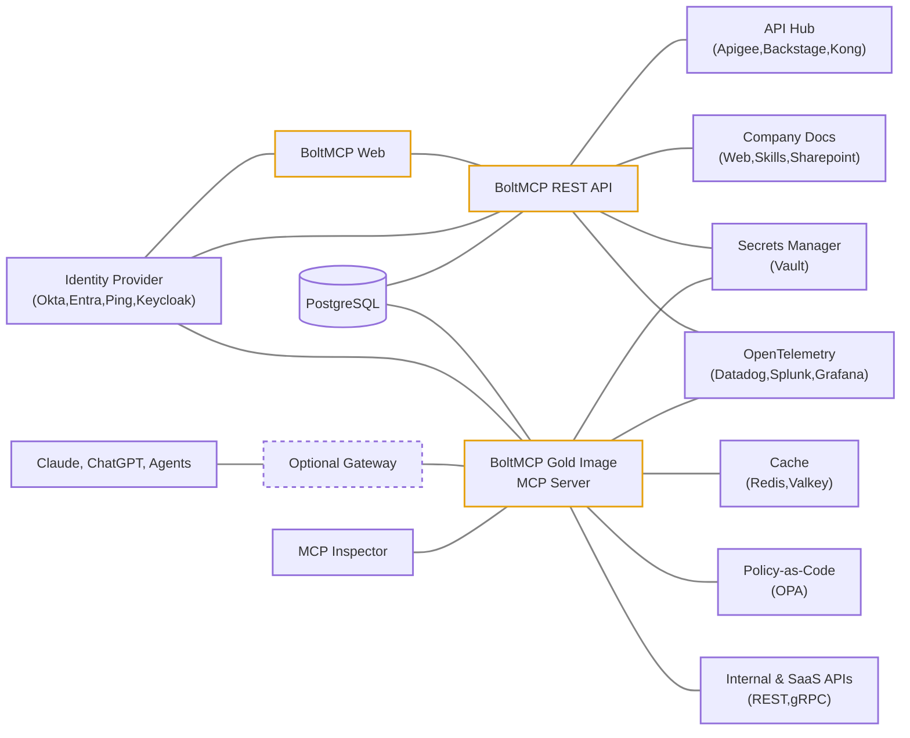

BoltMCP is a platform for creating and managing custom Model Context Protocol (MCP) servers. A single Helm chart deploys the full stack - application services and optional database and identity provider - into a single Kubernetes namespace.

## Architecture

## Database Isolation

Each BoltMCP service connects as its own PostgreSQL login role scoped to a `boltmcp_*` schema:

| Service | Login role | Schema | Access |
|---------|-----------|--------|--------|
| Web | `boltmcp_web` | `boltmcp_core` | Read/write |
| REST API | `boltmcp_rest_api` | `boltmcp_core` | Read/write |
| MCP Servers | `boltmcp_mcp_server` | `boltmcp_core` | Read-only |
| Migrations | `boltmcp_migrate_core` | `boltmcp_core` | Owner with full privileges |
| Keycloak | `boltmcp_keycloak` | `boltmcp_keycloak` | Owner with full privileges |
| Vault | `boltmcp_vault` | `boltmcp_vault` | Owner with full privileges |
