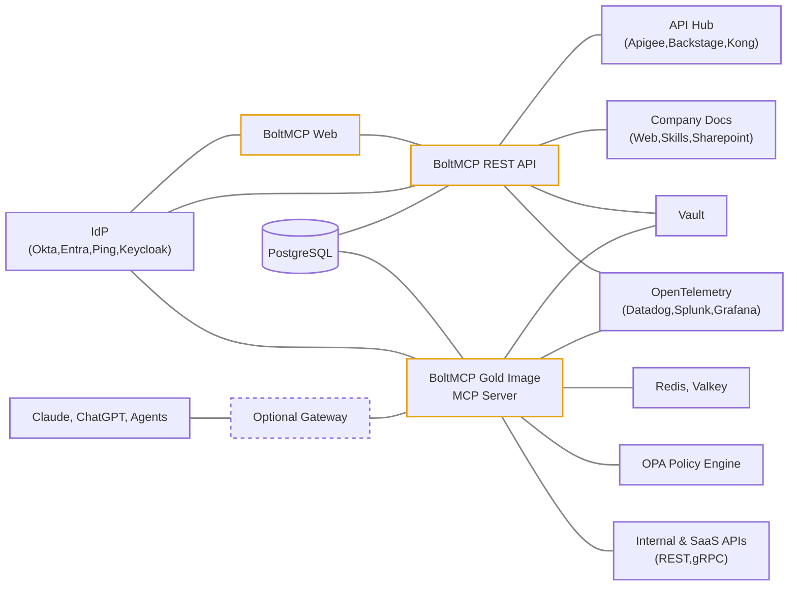

BoltMCP is a platform for managing and interacting with Model Context Protocol (MCP) servers. The Helm chart deploys the full stack — application services, database, identity provider, and optional tooling — into a single Kubernetes namespace.

## Architecture

Database migration jobs run as one-shot Helm hooks before application pods start. Init containers wait for PostgreSQL and Keycloak to be healthy before accepting traffic.

## Components

| Service | Port | Description |
|---------|------|-------------|
| **Web** | 3000 | Next.js application — primary UI and API |
| **MCP Server** | 3001 | Model Context Protocol server (read-only DB access) |
| **REST API** | 3003 (internal) | Versioned `/api/v1/*` service — ClusterIP only, consumed by Web (BFF proxy) and MCP Server |
| **Playground** | 3002 | MCP client for testing and interacting with MCP servers |
| **Keycloak** | 8080 | OpenID Connect identity provider for authentication |
| **PostgreSQL** | 5432 | Shared database with per-service schemas and users |
| **MCP Inspector** | 6274 | Optional debugging tool for MCP servers |
| **Vault** | 8200 | Optional HashiCorp Vault instance (dev mode only) |

## Database Isolation

The chart provisions separate database users with scoped access:

| User | Schema | Access |
|------|--------|--------|
| `boltmcp_web` | `public` | Full privileges (runs migrations) |
| `boltmcp_mcp_server` | `public` | Read-only (`SELECT` only) |
| `boltmcp_playground` | `boltmcp_playground` | Full privileges on own schema, read-only on public |
| `boltmcp_keycloak` | `boltmcp_keycloak` | Full privileges on own schema |

## Next Steps

<Cards>
  <Card title="Prerequisites" href="/docs/prerequisites" description="Cluster requirements and tooling" />
  <Card title="Deployment" href="/docs/deployment" description="Create your values file and install the chart" />
  <Card title="Configuration Reference" href="/docs/configuration-reference" description="Full parameter reference" />
</Cards>
